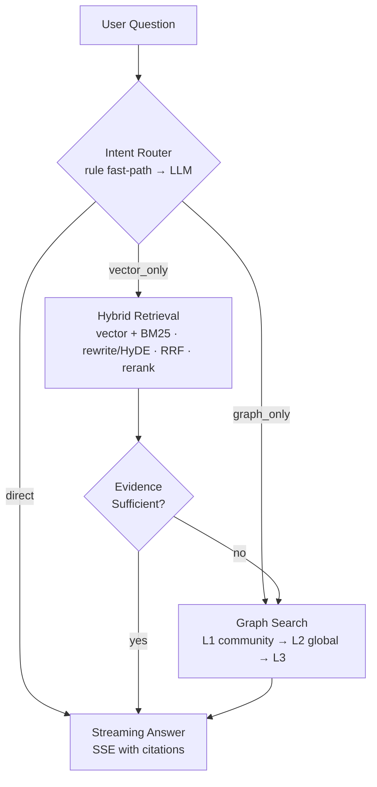
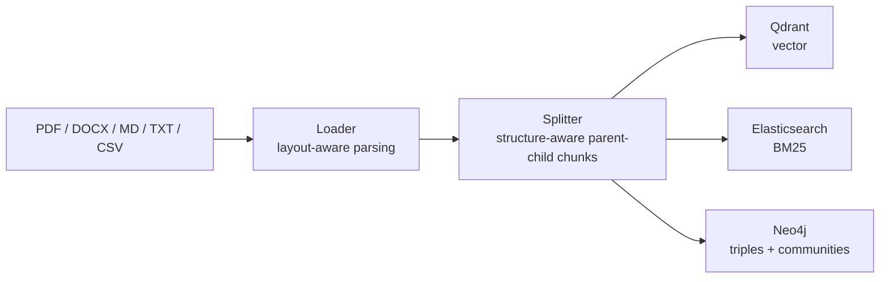

# JuYao Agentic RAG · 聚耀智能知识库

<p align="center">
  <strong>Enterprise Knowledge Base with Agentic RAG + GraphRAG</strong><br>
  Hybrid Retrieval · Intent Routing · Graph-Enhanced Q&A · Streaming Chat · Async Ingestion
</p>

<p align="center">
  <strong>面向企业知识库的 Agentic RAG + GraphRAG 开源方案</strong><br>
  混合检索 · 意图路由 · 图谱增强 · 流式对话 · 异步入库
</p>

<p align="center">
  
  
  
  
  
</p>

JuYao Agentic RAG is a full-stack enterprise knowledge base built on **Agentic RAG + GraphRAG**. The Python engine (`juyao-agentic-rag/`) handles retrieval, agentic orchestration and knowledge graphs; the Spring Boot admin (`juyao-admin/`) and Vue frontend (`juyao-ui/`) provide document management, chunk management, graph visualization and multi-tenant control.

> 项目是完整的企业知识库方案：Python 引擎为核心（检索/对话/图谱），Spring Boot 管理端 + Vue 前端提供文档管理、切片管理、图谱可视化与多租户能力。只想体验 RAG 能力的话，只跑 Python 引擎即可，无需 Java 与 Vue。

---

## Features / 核心特性

### Hybrid Retrieval · 混合检索
- **Dual-channel**: vector (Qdrant) + full-text BM25 (Elasticsearch) in parallel
- **Query rewriting** + **Multi-Query** + **HyDE** (fake answers stripped of `think` blocks, vector-channel only to avoid polluting BM25)
- **Double-layer RRF** fusion (within-query + cross-query) + **Cross-Encoder reranking**
- **Parent-child chunking (Small-to-Big)**: child chunks for precise embedding hits, parent chunks for full-context generation
- **Layout-aware PDF parsing** (PyMuPDF4LLM): tables → Markdown, cross-page table merging

### Agentic Orchestration · 意图编排
- **Cascade intent routing**: rule fast-path first (zero LLM cost), LLM judgment only for ambiguous queries
- Branches: `direct` / `graph_only` / `vector_only`
- **Sufficiency evaluation** → on-demand graph reinforcement when vector evidence is insufficient
- **Streaming SSE** answers with citation links

### GraphRAG · 知识图谱
- **Community-first search**: Leiden community detection + community summaries (persisted to MySQL)
- **L1 → L2 → L3 cascade**: community-first → global fallback → terminal, no chunk_id anchoring
- **A+B+C query pipeline**: rewriter + decomposer + entity mapping (n-gram + embedding dual-channel)
- Entity extraction on ingest, multi-hop relation queries (hops=2, edge/timeout bounded)
- Multi-graph isolation by label + tenant `kb_id` isolation end-to-end (Qdrant / ES / Neo4j / MySQL)

### Engineering · 工程化
- **Layered config**: env vars → `.env` → `config/local.toml` → `config/default.toml`; prompts externalized as hot-editable Markdown
- **Multiple access**: CLI / FastAPI (SSE) / Kafka async ingestion (3 partitions, parallel consumers, manual commit/retry/DLQ)
- **RAGAS evaluation toolkit**: concurrent retrieval + batch scoring, curated QA datasets
- **Graceful degradation**: rule fallback when LLM is down; vector-only fallback when ES is down
- **Chunk management UI**: parent-child drill-down, per-type slice rendering (table/code/text)

> 中文要点：混合检索（向量+BM25、改写+HyDE、双层 RRF+重排）；Agentic 编排（级联意图路由、充分性评估、按需图谱补强）；GraphRAG 社区优先（Leiden 社区 + L1/L2/L3 三级级联 + A+B+C 查询改写）；父子分块（子块检索→父块生成）；PDF 布局感知解析；多租户 kb_id 全链路隔离；CLI/FastAPI/Kafka 三接入；RAGAS 离线评测；LLM/ES 不可用时优雅降级。

## Architecture / 架构概览

### Q&A Path · 问答链路



### Ingestion Path · 入库链路



## Quick Start / 快速开始

### Option 1: Docker Compose (recommended) · 方式一：Docker Compose（推荐）

```bash
# 1. Start all infra services (Ollama / MySQL / Redis / ES / Qdrant / Neo4j / Kafka)
docker compose up -d

# 2. Pull the embedding model
docker exec -it juyao-ollama ollama pull mxbai-embed-large:latest
```

Then follow the [Engine README](juyao-agentic-rag/README.md) to install the Python package and start ingesting & chatting.

> 然后按引擎文档安装 Python 包，即可开始入库与问答。

### Option 2: Manual · 方式二：手动启动

```powershell
cd juyao-agentic-rag
pip install -e .
copy .env.example .env
# edit .env, fill in DASHSCOPE_API_KEY

python -m rag_core.cli.ingest --file src/data/samples/sample_medical.txt
python -m rag_core.cli.qa --question "简要介绍样例文档中的关键信息"
```

Full environment setup: [GETTING_STARTED.md](juyao-agentic-rag/docs/GETTING_STARTED.md) · 完整环境准备见[快速启动指南](juyao-agentic-rag/docs/GETTING_STARTED.md)。

## Repository Layout / 仓库结构

```
juyao-agentic-rag/          # Python RAG engine (core, standalone-installable)
├── src/rag_core/
│   ├── core/               # config (TOML + .env)
│   ├── domain/             # chunk_id / source_doc_id conventions
│   ├── llm/                # LLM factory, JSON structured output
│   ├── prompts/text/       # system prompts (editable Markdown)
│   ├── ingestion/          # load → split → index pipeline
│   ├── indexing/           # Qdrant / Elasticsearch clients
│   ├── retrieval/          # hybrid retrieval (rewrite, HyDE, RRF, rerank)
│   ├── knowledge_graph/    # Neo4j extraction, community detection & L1/L2/L3 search
│   ├── orchestration/      # agentic chat flow (routed_flow)
│   ├── memory/             # Redis multi-turn sessions
│   ├── api/                # FastAPI (SSE streaming)
│   └── cli/                # command-line entry points
├── src/rag_eval/           # RAGAS evaluation toolkit
├── config/                 # default config + local.toml template
├── docs/                   # architecture, API, design docs
└── tests/                  # unit tests
│
juyao-admin/                # Spring Boot 3 admin (HTTP + Kafka)
juyao-ui/                   # Vue 3 frontend (chat, document & chunk management, graph viz)
juyao-system/               # system module (document registry, tenant)
docker-compose.yml          # one-command infra startup
```

> 只需体验 RAG 能力，进入 `juyao-agentic-rag/` 即可，无需 Java 与 Vue。

## Dependencies / 依赖服务

| Service | Purpose | Required |
|---------|---------|----------|
| Ollama | Embedding / local reranking | ✅ Yes |
| Qdrant | Vector search | ✅ Yes |
| Elasticsearch 7.x | BM25 full-text search | ⭐ Recommended |
| Neo4j 5.x | GraphRAG knowledge graph | Optional (GraphRAG) |
| Redis 7.x | Multi-turn session memory | Optional (HTTP API mode) |
| Kafka 7.x (Confluent) | Async ingestion | Optional (Java admin integration) |
| MySQL 8.x | Chunk / community persistence, tenant | Optional (Java admin integration) |
| DashScope API | Chat / split / extraction / rerank | ✅ Yes (OpenAI-compatible) |

All infra services can be started with the repo's `docker-compose.yml` — 全部基础设施可用仓库内 `docker-compose.yml` 一键启动。

## Documentation / 文档

| Doc | Description |
|-----|-------------|
| [Engine README](juyao-agentic-rag/README.md) | Installation, CLI commands, config, HTTP API |
| [Getting Started](juyao-agentic-rag/docs/GETTING_STARTED.md) | Environment setup, self-check list, FAQ |
| [Architecture](juyao-agentic-rag/docs/ARCHITECTURE.md) | Request / ingestion / retrieval chains |
| [Agent Flow](juyao-agentic-rag/docs/AGENT_FLOW.md) | Full agentic pipeline incl. L1/L2/L3 graph cascade |
| [Parent-Child Chunking](juyao-agentic-rag/docs/PARENT_CHILD_CHUNKING.md) | Small-to-Big chunking design |
| [Evaluation](juyao-agentic-rag/docs/eval/GETTING_STARTED.md) | RAGAS setup, workflow & metrics |
| [Contributing](juyao-agentic-rag/CONTRIBUTING.md) | Dev conventions, PR process |
| [Design Reviews](juyao-agentic-rag/docs/README.md) | Full index of design & review docs (Chinese) |

## Contributing / 贡献

Issues and Pull Requests are welcome — 欢迎提交 Issue 和 Pull Request。Please read [CONTRIBUTING.md](juyao-agentic-rag/CONTRIBUTING.md) first.

## License / 许可证

MIT License — see [LICENSE](LICENSE). 本项目基于 [MIT License](LICENSE) 开源。

---

<p align="center">
  <sub>Built with LangChain · Qdrant · Elasticsearch · Neo4j · FastAPI · Spring Boot · Vue</sub>
</p>
