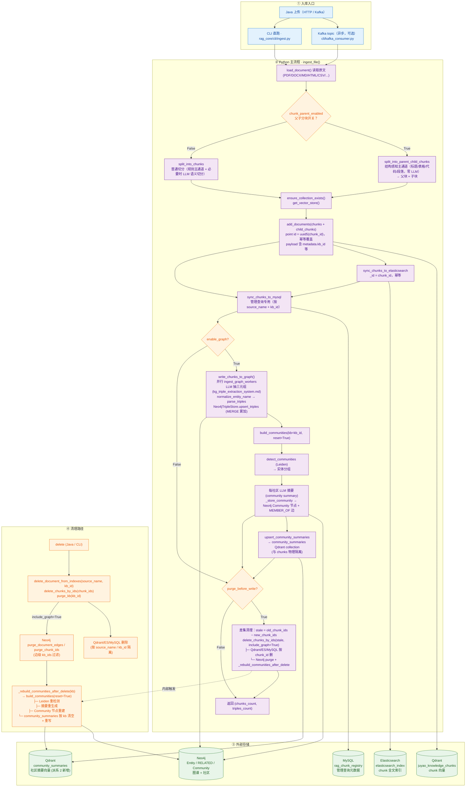

# 整体 Agent 流程图

> 涵盖 **HTTP 入口 → 意图路由 → 三条分支（direct / graph_only / vector_only） → 检索子管线（多 query + HyDE + 双层 RRF + 重排） → 图谱补强 → 流式生成 → SSE 输出** 的完整链路。
> 配套代码：`rag_core/api/routes/chat.py`、`rag_core/application/chat_flow/`、`rag_core/domain/retrieval/`、`rag_core/domain/graph/query/`。
> 创建：2026-08-11 · 更新：2026-08-12

> 2026-08-12 更新（派系 2 改造实施完成）：新增 §7 入库链路详细图 + §8 检索链路详细图两个独立 mermaid（含派系 2 L1/L2/L3 级联、社区摘要同步、三库写入、清理路径等）。原 §1 全局流程图保留为概览版。

> 2026-08-12 更新：图谱路径即将升级为派系 2 实施中（`GRAPH_QUERY_REVIEW.md §6.5`），以下 §0.4 路线 B/C、§0.5、§1 主流程图描述的图谱行为将在 8 步实施后变为新架构（社区优先 + L1/L2/L3 级联 + A+B+C + Prompt 同构 + 独立 collection + 删除 chunk_id 锚定）。当前文档描述的是**实施前**的旧架构，与代码同步更新将在 Step 7 完成后进行。

## 0. 用人话说一遍（先看这段再看图）

> 这一节不写代码、不画图，全程口语。看完下面的 mermaid 之前，建议先把这段读完——后面图里所有节点都能在脑子里找到对应的人/动作。

### 0.1 一句话总览

**用户问了一个问题，系统像一个老练的秘书那样决定：要不要查档案、查哪类档案、查完之后够不够、要不要再补一份人脉关系图，最后把答案一字一句流式写给用户。**

整条链路就是这一个故事。

### 0.2 类比：秘书小聚的工作日常

把整个系统想成一个秘书叫**小聚**（致敬聚耀），桌上摆着两样东西：

- � **档案柜**——里面是公司的合同、制度、报告（这就是向量库 + ES 全文检索）
- 🕸️ **人脉图谱**——是一张 A3 大纸，画着「张三在哪家公司 → 法人是谁 → 关联了哪些项目」（这就是 Neo4j 知识图谱）

老板扔过来一个问题，小聚的工作分四步：

| 步骤 | 秘书动作 | 系统对应 |
|---|---|---|
| **1️⃣ 掂量问题** | 老板问的是「你好」还是「合同里验收条款怎么写」？要不要查档案？ | **意图路由 B**：direct / graph_only / vector_only |
| **2️⃣ 找材料** | 翻档案柜、查人脉图 | **D 检索 + C/F 图谱** |
| **3️⃣ 够不够？** | 找到的这些能答上吗？要不要再翻一份关系图？ | **E 充分性判断** |
| **4️⃣ 写答案** | 一边写一边念给老板听（不等写完） | **H 流式生成** |

接下来一段一段讲每一步。

### 0.3 第 1 步 · 掂量问题（节点 B · 意图路由）

老板问题一进门，小聚先**自己拍脑袋**——不用问别人：

- 「你好」「谢谢」→ **不查档案**，直接寒暄回答（direct）
- 「小李和小王之间有什么关系？」→ **只查人脉图**，档案柜不用开（graph_only）
- 「合同验收条款怎么写？」→ **去档案柜找**（vector_only）
- 看不出来？→ 那才花钱**打电话问专家**（调 LLM）

**小诀窍**：能拍脑袋就不打电话，省钱省时间。打电话还打不通的话，再退回到拍脑袋。

### 0.4 第 2 步 · 找材料（三条路）

#### 路线 A · direct（啥也不查）

极少见，仅限寒暄。系统直接拿「无 KB 人设」回复，不让 AI 装知道。

#### 路线 B · graph_only（只查人脉图）

只发生在问题明显是「关系网型」时（人-人-公司、地址-位置、时间线等）。

小聚的步骤：

1. **从问题里抠出实体**：「小李」「小王」「A 公司」→ 这叫「实体抽取」
2. **到大图上找这些人**：找不到怎么办？看图谱的「社区摘要」（相当于看图边的注解）
3. **沿关系往外展开**：一度、二度、三度跳出去（多跳展开）
4. **把找到的关系整理成文字**：「小李 ←合伙→ A 公司 ←控股→ B 项目」

**兜底**：图上一条边都没找到？小聚**不会直接说「不知道」**，而是**退回档案柜再翻一遍**（graph_only → vector_only 降级）。

#### 路线 C · vector_only（默认走档案柜）

这是**最常走的路**。小聚不是只搜一次，而是一套组合拳：

**Step 1 · 拆问题**
- 原问题：「验收后多久付尾款？」
- 拆成 sub-query：「合同里关于尾款支付的条款」「合同里关于验收完成后多少天付款的约定」
- 再让 LLM 假装写一段「合同原文风格的话」（HyDE 假答案）——只用来检索，**不作为最终回答**

为什么？因为用户的问法经常和档案里的措辞差很远（用户说"算日期"，档案说"稳定运行 30 天"），所以**让 LLM 先模拟档案的口吻去搜**，命中率高得多。

简单问题（≤12 字且没有"为什么/怎么/多少"这种推理词）就**跳过拆解**，单 query 直搜——省时间。

**Step 2 · 多路并行搜**
每条 query 同时派两个人去找：
- 🧠 **向量检索**（语义相似）：问的是"意思"，找的是"意思相近的段落"
- 🔤 **全文检索 / ES**（关键词）：问的是"字面"，找的是"含这些词的段落"

两个结果按名次做一次融合（RRF，名次越高贡献越大），不是简单加分数——避免向量分 0.9 和 BM25 分 12 这种不同尺度的数直接相加。

**Step 3 · 跨 query 再融一次**
「尾款条款」命中 A、B 段，「验收付款约定」也命中 A、C 段——A 段被两个 query 都点名，自然排第一。

**Step 4 · 精排 + 多样性采样**
最后让一个"裁判"（cross-encoder rerank）对候选逐条精排，按相关性打分。同样是多 query 都做精排、再融合。

裁判打分后还要做一道菜：**同源多样性采样**——别让同一份合同的 5 个相邻段落挤占候选，要照顾到不同来源。

整个检索像筛沙子：

```
原始档案(几十万段)
  → 拆 query，多角度搜索    （百万级 → 几百段）
  → 单 query 内向量+ES 融合 （几百 → 几十段）
  → 跨 query 二次融合       （几十 → 十几段）
  → 精排                    （十几 → 几段）
  → 多样性采样              （几段 → 最终喂给 LLM 的）
```

### 0.5 第 3 步 · 够不够？（节点 E · 充分性判断）

小聚把找到的段落给「评估员」看一眼：

- **评估员**：读问题 + 段落，输出「够 / 不够」
- **如果够** → 直接去写答案（节点 G）
- **如果不够** → **再派人脉图出场补一补**（节点 F）

补图时也是讲究的：
1. **先按档案里的段落去查图**（chunk 锚定）—— 既然段落都来自某份合同，那合同里的人/公司关系图谱可能正好对得上
2. **查不到？** → 再退回「从问题里抠实体去查图」（问句实体兜底）

充分性判断自己也分三档：
- **简单规则档**：没结果 / 分数太低 → 直接判不够
- **LLM 精判档**：让 LLM 看一眼（默认档）
- **LLM 失败档**：退回简单规则档

### 0.6 第 4 步 · 写答案（节点 H · 流式生成）

小聚开始**一边写一边念**——用户看到的是「文字一个 token 一个 token 冒出来」，不是等全部写完才显示。

写之前选 prompt：
- **查到了材料** → 「你有知识库/图谱依据，请引用」+ 资料正文（prompt 是「基于 Observation 严谨作答」）
- **啥也没查到** → 「没有 KB 依据，禁止编造内部文档」+ 默认人设

写完之后：
- 如果中途用到了图谱 → 末尾加一行「—— 图谱补充：共 N 条关系」
- 加一行免责声明
- 把完整回复存到 Redis，供下一轮对话参考

### 0.7 整条链路串起来（一次完整对话）

```
老板问："项目验收后多久付尾款？"
   │
   ↓ [1. 小聚掂量] 推理型 + 没寒暄 → 拍脑袋说"去档案柜"
   │
   ↓ [2a. 拆问题]  LLM 拆出 sub-queries + HyDE 假答案
   │
   ↓ [2b. 多路搜]  每条 query：向量 + ES 并行 → 单 query RRF
   │
   ↓ [2c. 跨融合]  多 query 命中段 → 跨 query RRF
   │
   ↓ [2d. 精排]    cross-encoder rerank → 多样性采样 → 8~10 段
   │
   ↓ [3. 够不够？] 评估员读 question + 段落 → "够"
   │
   ↓ [4. 写答案]   prompt 选了有 KB 的，流式写 → 边写边发
   │
   ↓ 客户端 SSE:  meta → token → token → ... → done
```

老板看到的就是：「meta（告诉你这次走了哪条路）→ 一段段中文蹦出来 → 完事」。

### 0.8 三条岔路什么时候走？

| 老板问的是 | 小聚走哪条 | 为什么 |
|---|---|---|
| 「你好」「谢谢」 | direct | 寒暄不浪费检索 |
| 「张三和王五是什么关系」 | graph_only | 关系型问题，图谱快 |
| 「合同里验收条款怎么写」 | vector_only | 字面/语义型，档案柜强 |
| 「A 验收后多久付尾款」（推理/算日期型） | vector_only | 推理型，先向量检索，再按需补图 |
| 看不出来 | 先尝试 vector_only | 漏检索比多检索代价高（兜底策略） |

### 0.9 一句话记忆口诀

> **掂量 → 找材料 → 够不够 → 写答案**
> **路由 → 检索+图谱 → 充分性 → 流式生成**
> **直接走、查图、先查档再补图，三选一**
> **找材料靠组合拳（多 query + 多路 + 双层融合 + 精排 + 多样性）**

---

## 1. 全局流程图

```mermaid
flowchart TB
    %% ====================== 1. HTTP 入口 ======================
    subgraph HTTP["① HTTP 层 — api/routes/chat.py"]
        direction TB
        H1["POST /api/v1/chat/stream<br/>body: {user_id, session_id, message, kb_id}"]
        H2["require_internal_token<br/>内部 token 鉴权（P1-1 防 8000 直连）"]
        H3["Redis load_messages<br/>按 user_id+session_id 读历史"]
        H4["构造 event_gen() SSE 生成器<br/>assistant_holder + tool_messages_holder"]
    end

    %% ====================== 2. 对话入口 ======================
    subgraph ENTRY["② 对话入口 — chat_flow/entry.py"]
        direction TB
        E1["astream_chat_events(question, history,<br/>assistant_holder, kb_id)"]
        E2["require_dashscope_api_key<br/>无 key 直接抛错"]
    end

    %% ====================== 3. 主流程编排 ======================
    subgraph FLOW["③ 主流程编排 — chat_flow/flow.py"]
        direction TB
        F0["routed_astream_chat_events<br/>构造 FlowState(question, history, kb_id, ...)"]

        %% 节点 B 意图路由
        F1["Step 1 · 节点 B 意图路由<br/>steps/route.py: run_route_step"]

        %% 路由级联
        F1A["规则快路径（零 LLM）<br/>route_question_intent_rules(q)"]
        F1A1{"规则能确定？"}
        F1B["LLM JSON 判定<br/>route_question_intent_llm<br/>backend = 'llm'"]
        F1B1{"LLM 成功？"}
        F1C["规则兜底<br/>backend = 'rules_fallback'"]
        F1D["配置 mode=rules<br/>backend = 'rules'（纯规则）"]

        %% 路由结果
        FBR{"RouteBranch = ?"}

        %% 三条分支
        FD["分支 · direct<br/>stop_reason = route_direct_no_tools<br/>observation 追加系统提示"]
        FG["分支 · graph_only<br/>graph_query_enabled ?"]
        FV["分支 · vector_only（默认）<br/>D → E → F|G"]

        %% graph_only 子分支
        FG_ON["graph_query_enabled=True"]
        FG_ON_C["节点 C · run_graph_query_step<br/>build_graph_observation_question_driven<br/>问句实体 → Neo4j 多跳"]
        FG_ON_0{"had_graph_edges ?"}
        FG_ON_DG["0 边：降级 run_retrieve_step<br/>stop_reason = graph_only_fallback_vector<br/>（P1-2 修复，原直接判无证据）"]
        FG_OFF["graph_query_enabled=False<br/>降级 run_retrieve_step<br/>stop_reason = graph_disabled_fallback_vector"]

        %% vector_only 管线
        FV_D["节点 D · run_retrieve_step<br/>search_context(question, kb_id)<br/>写入 merged_docs / max_score / observation"]
        FV_E["节点 E · run_sufficiency_step<br/>decide_vector_path_needs_graph_supplement"]
        FV_E_pre{"max_score &lt; min_relevance_score ?"}
        FV_E_pre_T["need_g=True · backend=heuristic_low_score_precheck"]
        FV_E_mode{"rag_sufficiency_mode"}
        FV_E_HE["heuristic 模式<br/>空结果 / 低分 = 不足<br/>backend = heuristic_*"]
        FV_E_LLM["LLM 模式（默认）<br/>读 question + Observation → JSON<br/>_rag_sufficiency_llm"]
        FV_E_FALL{"LLM 失败？"}
        FV_E_LLMOK["backend = 'llm'"]
        FV_E_LLMFB["回退启发式<br/>backend = llm_fallback_heuristic"]
        FV_E_G{"need_g = ?"}
        FV_F["节点 F · run_graph_supplement_step<br/>build_graph_observation_text(chunk_ids)<br/>chunk 锚定 → 0 边则问句实体兜底"]
        FV_G["走 G（仅向量证据）<br/>stop_reason = route_vector_only"]
        FV_HV["stop_reason = vector_then_graph_supplement"]

        %% meta + finalize
        FHAD["had_evidence = (merged_docs ∨ had_graph_edges)"]
        FLOG["_log_graph_snapshots 排查日志"]
        FMETA["yield ('meta', _build_meta)<br/>citations / score / route_branch / executed_steps / graph_snapshot_meta"]
        FFINAL["Step · 节点 H stream_final_answer<br/>finalize.py"]
    end

    %% ====================== 4. 检索子管线 ======================
    subgraph RET["④ 检索子管线 — domain/retrieval/retriever.py"]
        direction TB
        R1["search_context(query, kb_id)<br/>1. 收集所有 query specs"]
        R_SIMPLE{"_is_simple_query<br/>≤12 字 + 无推理动词？"}
        R_SIMPLE_T["简单事实型：单 query<br/>跳过 LLM 改写/HyDE（省时延）"]
        R_QR["rewrite_query<br/>LLM 拆 sub-queries<br/>失败静默返回 []"]
        R_HYDE["generate_hypothetical_answer<br/>HyDE 假答案片段（条款风格 80~200 字）"]
        R_HYDE_FLAG["vector_only=True<br/>（HyDE 仅走向量，不污染 BM25）"]
        R2["2. _parallel_retrieve(specs)<br/>每条 query 并行：向量 + ES（HyDE 跳过 ES）"]
        R_VEC["Qdrant 向量召回 top_k<br/>kb_id 强制过滤（防串库）"]
        R_ES["Elasticsearch BM25 召回 top_k"]
        R_THR["阈值过滤<br/>threshold = min(绝对阈值, 最高分×相对比例)<br/>（P1 相对截断）"]
        R_RRF1["单 query 内 RRF<br/>fuse_two_rankings(vec, es, rrf_k)"]
        R_RRF2["3. 跨 query 二次 RRF<br/>fuse_query_rankings(per_query, rrf_k)<br/>多 query 都命中的 chunk 自然加分"]
        R_TRUNC["截断到 rrf_top_n 进入 rerank"]
        R_RERANK["4. rerank_documents_multi<br/>每条 query 并行 Cross-Encoder / Ollama rerank<br/>失败路不贡献（其他路继续）；全失败→回退 RRF 顺序"]
        R_RERRRF["跨 query rerank RRF 聚合<br/>复用 fuse_query_rankings"]
        R_DIV["_diversify_by_source<br/>按 source_name 同源多样性采样<br/>per_source=2，不足时回填"]
        R_MAXS["max_score = 各 query 向量原始相似度最大值<br/>（仅展示用，不参与排序）"]
        R_PARENT["父子块：子块命中 → 映射父块<br/>_fetch_parents_by_ids 按 chunk_id 取父块"]
        R_RET["返回 RetrievedContext(documents, max_score)"]
    end

    %% ====================== 5. 图谱子管线 ======================
    subgraph KG["⑤ 图谱子管线 — domain/graph/query/observation.py"]
        direction TB
        K1["节点 C · 问句驱动<br/>build_graph_observation_question_driven"]
        K1A["QuestionGraphSeedExtractor.extract(q)<br/>LLM 抽实体 + relation_hints"]
        K1B{"命中实体？"}
        K1C["resolve_entity_names<br/>实体规范化匹配 Neo4j 节点"]
        K1D{"matched 非空？"}
        K1E["query_edges_from_entity_seeds<br/>多跳展开（最多 max_hops 层）"]
        K1F["edges=0 ?"]
        K1G["global 兜底：_community_summaries_for_question<br/>2/3-gram 重叠度取 top 2 社区摘要"]
        K1H["Observation: '图谱查询暂时不可用 / 0 边' 等"]

        K2["节点 F · 补图<br/>build_graph_observation_text(chunk_ids)"]
        K2A["query_edges_for_chunks(chunk_ids)<br/>chunk 锚定优先（确定性信号，P0-1 修复死代码）"]
        K2B{"edges=0 ?"}
        K2C["0 边兜底：build_graph_observation_question_driven<br/>source = 'question_entities_supplement'"]
        K2D["format_edges_for_prompt<br/>chunk / 头尾类型 / 关系大类 / time+location hints / evidence"]

        K3["_append_graph_step 落盘<br/>observation_lines + graph_snapshots + executed_steps<br/>(tool = query_knowledge_graph)"]
    end

    %% ====================== 6. finalize + SSE ======================
    subgraph FIN["⑥ 流式生成 + SSE 输出"]
        direction TB
        L1["finalize.stream_final_answer"]
        L2{"had_evidence ?"}
        L3A["True → SYSTEM_PROMPT（有 KB/图谱）<br/>prefix = KB_ANSWER_PREFIX"]
        L3B["False → SYSTEM_PROMPT_NO_KB_EVIDENCE<br/>prefix = NO_KB_STREAM_PREFIX"]
        L4["yield ('token', {content: prefix})"]
        L5["get_chat_llm(streaming=True).astream<br/>构造 messages = [System, *history, Human(execute_user_prompt)]<br/>execute_user_prompt = question + observation_lines"]
        L6["async for chunk in astream<br/>yield ('token', {content})"]
        L7["graph_snapshots 非空 → format_graph_snapshots_footer<br/>追加 '—— 图谱补充: 共 N 条关系' 页脚"]
        L8["追加 DISCLAIMER / DISCLAIMER_NO_KB_REFERENCES"]
        L9["assistant_holder.clear() + append(完整回复)<br/>供 Redis append_turn 持久化"]
        LSSE["SSE 输出：meta → token* → done / error<br/>text/event-stream, no-cache"]
    end

    %% ====================== 7. 落库 ======================
    subgraph PERSIST["⑦ 会话持久化"]
        P1["Redis append_turn<br/>(user_msg, assistant_msg, tool_messages)<br/>按 chat_max_rounds + chat_history_ttl_seconds 滚动"]
    end

    %% ====================== 连线 ======================
    U(["用户消息"]) --> H1 --> H2 --> H3 --> H4 --> E1 --> E2 --> F0 --> F1
    F1 --> F1A --> F1A1
    F1A1 -- "命中（问候/图谱特征/向量字面）" --> FBR
    F1A1 -- "None（规则不确定）" --> F1B
    F1A1 -. "mode=rules 时：纯规则路径" .-> F1D
    F1B --> F1B1
    F1B1 -- "成功" --> FBR
    F1B1 -- "失败" --> F1C --> FBR
    F1D --> FBR

    FBR -- "direct" --> FD --> FHAD
    FBR -- "graph_only" --> FG --> FG_ON
    FG_ON -- "True" --> FG_ON_C --> FG_ON_0
    FG_ON_0 -- "True（图谱有边）" --> FHAD
    FG_ON_0 -- "False（0 边）" --> FG_ON_DG --> FHAD
    FG_ON -- "False" --> FG_OFF --> FHAD
    FBR -- "vector_only" --> FV --> FV_D

    %% 检索子管线细节
    FV_D --> R1 --> R_SIMPLE
    R_SIMPLE -- "是" --> R_SIMPLE_T --> R2
    R_SIMPLE -- "否" --> R_QR --> R_HYDE
    R_HYDE -- "非空" --> R_HYDE_FLAG --> R2
    R_HYDE -- "空/失败" --> R2
    R2 --> R_VEC --> R_THR
    R_VEC --> R_PARENT
    R_THR --> R_ES --> R_RRF1
    R_THR -- "HyDE 通道：跳过 ES" --> R_RRF1
    R_RRF1 --> R_RRF2 --> R_TRUNC --> R_RERANK --> R_RERRRF --> R_DIV --> R_MAXS --> R_RET --> FV_E

    %% 充分性判断
    FV_E --> FV_E_pre
    FV_E_pre -- "是" --> FV_E_pre_T --> FV_E_G
    FV_E_pre -- "否" --> FV_E_mode
    FV_E_mode -- "heuristic" --> FV_E_HE --> FV_E_G
    FV_E_mode -- "llm（默认）" --> FV_E_LLM --> FV_E_FALL
    FV_E_FALL -- "成功" --> FV_E_LLMOK --> FV_E_G
    FV_E_FALL -- "失败" --> FV_E_LLMFB --> FV_E_G
    FV_E_G -- "True" --> FV_F --> FV_HV --> FHAD
    FV_E_G -- "False" --> FV_G --> FHAD

    %% 图谱子管线细节
    FG_ON_C -. "→" .-> K1
    FV_F -. "→" .-> K2
    K1 --> K1A --> K1B
    K1B -- "失败" --> K1H
    K1B -- "无实体" --> K1H
    K1B -- "有实体" --> K1C --> K1D
    K1D -- "未命中" --> K1G --> K1H
    K1D -- "命中" --> K1E --> K1F
    K1F -- "0 边" --> K1G --> K1H
    K1F -- "有边" --> K2D --> K3

    K2 --> K2A --> K2B
    K2B -- "有边" --> K2D --> K3
    K2B -- "0 边" --> K2C -. "复用 K1 路径" .-> K1A
    K3 --> FHAD

    FHAD --> FLOG --> FMETA --> FFINAL --> L1 --> L2
    L2 -- "True" --> L3A --> L4
    L2 -- "False" --> L3B --> L4
    L4 --> L5 --> L6
    L6 --> L7 --> L8 --> L9 --> LSSE --> P1

    %% 样式
    classDef entry fill:#e3f2fd,stroke:#1976d2,color:#0d47a1
    classDef decision fill:#fff3e0,stroke:#ef6c00,color:#e65100
    classDef route fill:#f3e5f5,stroke:#6a1b9a,color:#4a148c
    classDef retrieve fill:#e8f5e9,stroke:#2e7d32,color:#1b5e20
    classDef kg fill:#fce4ec,stroke:#ad1457,color:#880e4f
    classDef final fill:#ede7f6,stroke:#4527a0,color:#311b92
    classDef persist fill:#f5f5f5,stroke:#616161,color:#212121

    class H1,H2,H3,H4,E1,E2 entry
    class FBR,FG_ON_0,FV_E_pre,FV_E_mode,FV_E_FALL,FV_E_G,R_SIMPLE,F1A1,F1B1,K1B,K1D,K1F,K2B,L2 decision
    class F1,F1A,F1B,F1C,F1D,FD,FG,FV route
    class R1,R_QR,R_HYDE,R2,R_VEC,R_ES,R_THR,R_RRF1,R_RRF2,R_RERANK,R_RERRRF,R_DIV,R_PARENT,R_RET retrieve
    class K1,K1A,K1C,K1E,K2,K2A,K2C,K2D,K3 kg
    class FFINAL,L1,L3A,L3B,L5,L6,L7,L8,L9,LSSE final
    class P1 persist
```



## 2. 关键设计点速览

| 阶段 | 设计意图 | 关键模块 |
|---|---|---|
| **B 路由级联** | 规则快路径零 LLM；规则不确定才调模型；LLM 失败回退规则 | `steps/route.py: resolve_intent_route` |
| **E 充分性判断** | 启发式兜底（空/低分）+ LLM 精判；失败再回退启发式 | `steps/sufficiency.py` |
| **C 图谱优先** | 问句实体抽取 → 节点匹配 → 多跳展开；0 边时降级向量（P1-2） | `domain/graph/query/observation.py` |
| **F 补图锚定** | chunk 锚定优先（确定性信号），0 边才走问句实体兜底（修复 P0-1 死代码） | `steps/graph_supplement.py` |
| **D 多 query 检索** | 原 query + LLM 改写 sub-queries + HyDE 假答案；简单 query 跳过 LLM | `domain/retrieval/retriever.py` |
| **双层 RRF** | 单 query 内向量+ES 名次融合 → 跨 query 名次二次融合（公式统一） | `domain/retrieval/fusion.py` |
| **多 query rerank** | 每条 query 并行精排 → 跨 query RRF 聚合 → 同源多样性采样 | `domain/retrieval/reranker.py` |
| **HyDE 防污染** | 标记 `vector_only=True`，跳过 ES（避免假答案稀释 BM25 关键词） | `domain/retrieval/hyde.py` |
| **父子块映射** | 子块命中 → `_fetch_parents_by_ids` 按 `chunk_id` 取父块并去重 | `retriever.py:_fetch_parents_by_ids` |
| **H 流式生成** | `had_evidence` 决定 system prompt；图谱页脚 + 免责声明；`assistant_holder` 供 Redis 持久化 | `steps/finalize.py` |
| **SSE 契约** | `meta`（首）→ `token*` → `done/error`（末）；`executed_steps` 字段只增不减 | `api/routes/chat.py` |

## 3. 备选 / 兜底路径汇总

- **路由级联**：rules → llm → rules_fallback
- **graph_only 0 边**：自动降级向量检索（不是直接判无证据）
- **graph_query_enabled=False**：图谱总开关关闭时降级向量
- **vector_then_graph_supplement=False**：节点 E 直接判 sufficient，跳过 F
- **simple query**（≤12 字 + 无推理动词）：跳过 LLM 改写与 HyDE，节省时延
- **HyDE 失败 / 空文本**：静默跳过 HyDE 通道；不阻塞主流程
- **rerank 全路失败**：回退 RRF 截断顺序，仍做同源多样性采样
- **图谱 Neo4j 不可用**：Observation 输出 `图谱查询暂时不可用`，节点 C/F 仍返回 0 边而非崩溃
- **实体未命中节点**：`_community_summaries_for_question` 用 2/3-gram 重叠度兜底社区摘要

## 4. 各阶段详细步骤（拆分版）

> 下方按主流程节点逐节展开，便于排查与新成员上手。

### 4.1 节点 B · 意图路由（步骤 1）

**入口**：`FlowState.question` → `run_route_step(state)` → `resolve_intent_route(question)` → `IntentRouteResult(branch, backend)`

**级联顺序**：

1. **规则快路径**（`route_question_intent_rules`，零 LLM 调用）
   - 命中 `_DIRECT_GREETING_RE`（问候/寒暄）→ `direct`（仅在非 strict 模式）
   - 命中 `_GRAPH_COMPLEX_RE` / `_MULTI_ENTITY_AND_RE` / `should_invoke_graph_by_rules` → `graph_only`
   - 命中 `_VECTOR_LITERAL_RE`（长什么样 / 原文摘录等）且未命中图谱特征 → `vector_only`
   - 均未命中 → 返回 `None`，进入下一级
2. **LLM 精判**（`route_question_intent_llm`，JSON 输出）
   - strict 模式收到 `direct` → 强改 `vector_only`（知识库"漏检索"比"多检索"代价高）
   - 非严格模式下，非问候的 `direct` 也强制改 `vector_only`（意图路由误判修复）
3. **规则兜底**：LLM 异常时 `route_question_intent_rules(question) or RouteBranch.VECTOR_ONLY`，`backend = rules_fallback`

**配置开关**：

- `intent_route_mode=rules` → 跳过 LLM，纯规则（调试 / 降级用）
- `flowchart_strict_mode=True` → 不允许 `direct`，二分支 `graph_only | vector_only`

**写入状态**：`state.route`、`state.intent_backend`，并记入 `meta.intent_route_backend`。

### 4.2 节点 C · 图谱仅查（graph_only 分支）

**入口**：`run_graph_query_step(state, round_idx=1)` → `build_graph_observation_question_driven(question, round_idx, kb)`

**子流程**：

1. `QuestionGraphSeedExtractor().extract(question)`：LLM 抽实体 + relation_hints（失败 → Observation 输出"问句实体抽取失败"，返回 0 边）
2. `resolve_entity_names(entities)`：实体规范化匹配 Neo4j 节点（未命中 → `_community_summaries_for_question` 兜底）
3. `query_edges_from_entity_seeds(matched, relation_hints=hints, kb)`：多跳展开（受 `max_hops` / `relation_category_hints` 约束）
4. `format_edges_for_prompt`：按 chunk / 头尾类型 / 关系大类 / time+location hints / evidence 摘录（每条 ≤120 字）拼装 Observation
5. `_append_graph_step`：写入 `observation_lines` + `graph_snapshots` + `executed_steps`（`tool = query_knowledge_graph`）

**降级规则**：

- `had_graph_edges=False` → 自动 `run_retrieve_step`，`stop_reason = graph_only_fallback_vector`（修复 P1-2：原实现直接判无证据）
- `graph_query_enabled=False` → 跳过 C 直接降级向量检索，`stop_reason = graph_disabled_fallback_vector`

### 4.3 节点 D · 向量检索（vector_only 分支的步骤 2）

**入口**：`run_retrieve_step(state, round_idx=1)` → `execute_retrieval_step(query, round_idx, kb_id)` → `search_context(query, kb_id)`

详见 §4.5「检索子管线详解」。`state.merged_docs / max_score / retrieval_rounds` 同步更新。

### 4.4 节点 E · 充分性判断

**入口**：`run_sufficiency_step(state)` → `decide_vector_path_needs_graph_supplement(...)`

**判定顺序**：

1. **前置低分拦截**：`max_score < min_relevance_score` → `need_g=True`，`backend = heuristic_low_score_precheck`（避免无谓调 LLM）
2. **空结果**：直接 `need_g=True`，`backend = heuristic_empty`
3. `vector_then_graph_supplement=False` → 直接判 sufficient（`supplement_disabled`）
4. **模式分支**（`rag_sufficiency_mode`）：
   - `heuristic`：仅启发式（空 / 低分）
   - `llm`（默认）：`_rag_sufficiency_llm(question, observation)` → JSON `sufficient`；失败回退启发式
5. 写入 `state.needs_graph` 与 `state.rag_e_backend`

### 4.5 检索子管线详解（步骤 2 的内部）

**入口**：`search_context(query, kb_id)`，共 4 个步骤：

#### 4.5.1 Step 1 · 组装 query specs

- **简单问题短路**（`_is_simple_query`：≤12 字且无推理/对比动词）→ 只用原 query
- 否则追加：
  - `rewrite_query`：LLM 拆 1~N 条事实型 sub-queries（失败静默返回 `[]`）
  - `generate_hypothetical_answer`：HyDE 假答案（陈述语气、80~200 字、条款风格），标记 `vector_only=True` 跳过 ES

#### 4.5.2 Step 2 · 每条 query 并行召回

- 向量：`Qdrant.similarity_search_with_relevance_scores`，强制 `kb_id` 过滤（防串库）
- 父子模式：子块命中 → `_fetch_parents_by_ids` 按 `chunk_id` 取父块，按名次取最优子块分数
- ES：`Elasticsearch` BM25 top_k（HyDE 通道跳过）
- 阈值过滤：`threshold = min(绝对阈值, 最高分×相对比例)`（P1 相对截断）
- 单 query 内 RRF：`fuse_two_rankings(vec, es, rrf_k)`

#### 4.5.3 Step 3 · 跨 query RRF

`fuse_query_rankings(per_query_results, rrf_k)`：把所有 query 的名次结果二次融合，多 query 都命中的 chunk 自然加分。截断到 `rrf_top_n` 进入 rerank。

#### 4.5.4 Step 4 · 多 query 精排

- `rerank_documents_multi`：每条 query 并行 rerank（Cross-Encoder DashScope 或 Ollama `/api/rerank`）
- 任一路失败 → 该路不贡献，其他路继续；全失败 → 回退 RRF 截断顺序
- 跨 query rerank RRF 聚合（复用 `fuse_query_rankings`）
- `_diversify_by_source`：每 source 最多 2 条，不足时回填
- `max_score`：取所有 query 向量原始相似度的最大值（仅展示用）

### 4.6 节点 F · 补图（vector_only 后置补强）

**入口**：`run_graph_supplement_step(state, round_idx=2)` → `build_graph_observation_text(chunk_ids, round_idx, kb)`

**优先级**（修复 P0-1 死代码）：

1. **chunk 锚定优先**（确定性信号）：`query_edges_for_chunks(state.merged_docs.keys())`
2. **0 边兜底**：`build_graph_observation_question_driven`（复用 C 的链路，`source = question_entities_supplement`）

`_append_graph_step` 统一落盘：`observation_lines + graph_snapshots + executed_steps`。

### 4.7 节点 H · 流式生成与 SSE 输出

**入口**：`stream_final_answer(question, history, observation_lines, had_evidence, graph_snapshots, assistant_holder)`

**prompt 选择**：

- `had_evidence=True` → `SYSTEM_PROMPT`（有 KB/图谱依据，要求引用 observation）+ `KB_ANSWER_PREFIX`
- `had_evidence=False` → `SYSTEM_PROMPT_NO_KB_EVIDENCE`（无 KB 人设，禁止虚构内部文档依据）+ `NO_KB_STREAM_PREFIX`

**消息构造**：

```
messages = [
    SystemMessage(system_text),
    *history_dicts_to_messages(history),
    HumanMessage(build_execute_user_prompt(question, observation_lines)),
]
```

**流式输出**：

1. `yield ('token', {content: prefix})`
2. `async for chunk in get_chat_llm(streaming=True).astream(messages)` → `yield ('token', {content})`
3. 若 `graph_snapshots` 非空 → `format_graph_snapshots_footer` 追加 `—— 图谱补充: 共 N 条关系`
4. 追加 `DISCLAIMER` / `DISCLAIMER_NO_KB_REFERENCES`
5. `assistant_holder.clear()` 后 `append(f"{prefix}{raw_answer}{footer}{tail}")` 供 Redis 持久化

**SSE 契约**（由 `api/routes/chat.py` 封装）：

```
event: meta\ndata: { ... }
event: token\ndata: {"content": "..."}
...
event: done\ndata: {}
```

异常分支 → `event: error\ndata: {"error": str(exc)}`，已写入的 `assistant_holder` 不会持久化。

### 4.8 会话持久化

`append_turn(redis, user_id, session_id, user_msg, assistant_msg, tool_messages, max_rounds, ttl_seconds)`：

- 按 `chat_max_rounds` 滚动（多轮对话窗口）
- TTL `chat_history_ttl_seconds` 控制过期
- 异常时 `logger.exception` 但不影响 SSE `done` 事件

## 5. SSE meta 事件载荷（对外契约）

`meta` 事件 key 集合（只增不减，前端与 Java `RagChatClient` 依赖）：

| key | 含义 | 来源 |
|---|---|---|
| `citations` | 引用的 chunk_id 列表 | `state.merged_docs.keys()` 排序 |
| `score` | 向量最高相似度 | `state.max_score` |
| `retrieval_rounds` | 向量检索轮数 | `state.retrieval_rounds` |
| `graph_rounds` | 图谱检索轮数 | `state.graph_rounds` |
| `had_evidence` | 是否存在证据 | `merged_docs ∨ had_graph_edges` |
| `planner_iterations` | 规划迭代次数 | 固定 1（步骤式编排） |
| `stop_reason` | 终止原因 | 详见 §3 |
| `plan` | 计划步骤描述 | `intent_route` + `rag_sufficiency_eval` |
| `executed_steps` | 决策轨迹 | `StepRecord.to_dict()` 列表 |
| `graph_snapshot_meta` | 图谱快照摘要 | `build_graph_snapshot_meta` |
| `route_branch` | 路由支线 | `state.route.value` |
| `intent_route` | 同上（兼容旧 key） | `state.route.value` |
| `intent_route_mode` | 路由模式配置 | `intent_route_mode` |
| `intent_route_backend` | 路由实际后端 | `state.intent_backend` |
| `flowchart_strict_mode` | 严格模式开关 | `flowchart_strict_mode` |
| `rag_sufficiency_mode` | 充分性模式 | `rag_sufficiency_mode` |
| `rag_sufficiency_backend` | 充分性后端 | `state.rag_e_backend` |

`executed_steps` 元素字段（兼容旧实现，只增不减）：

| key | 含义 |
|---|---|
| `name` | 步骤名（route / retrieve / sufficiency / graph_supplement / graph_query / finalize） |
| `status` | ok / failed / skipped |
| `tool` | search_knowledge_base / query_knowledge_graph |
| `ms` | 步骤耗时（ms，保留 1 位小数） |
| `input_summary` | 输入摘要 |
| `output_summary` | 输出摘要 |
| `tool` / `edge_count` / `entity_seeds` / `doc_count` / `max_score` / `is_empty` / `query` / `round` | 旧字段（按需保留） |

## 6. 相关文档

- [ARCHITECTURE.md](./ARCHITECTURE.md) — 原始架构速览（HTTP / 入库 / 检索三条链路总览）
- [ARCHITECTURE_REVIEW.md](./ARCHITECTURE_REVIEW.md) — 架构评审（§9 决策 + §10 映射表）
- [RETRIEVAL_REVIEW.md](./RETRIEVAL_REVIEW.md) — 检索评审（相对截断/漏斗扩容/多样性/match_phrase/查询分级）
- [GRAPH_QUERY_REVIEW.md](./GRAPH_QUERY_REVIEW.md) — 图谱评审（查询/入库/社区/兜底）
- [PITFALLS.md](./PITFALLS.md) — 踩坑记录（P0-1 补图死代码 / P1-1 鉴权 / P1-2 graph_only 0 边等）

---

## 7. 入库链路（Ingest Pipeline · 详细图）

> 范围：`application/ingest_flow/ingest.py` + `cleanup.py` + `application/graph/community_build.py` + `infrastructure/qdrant.py` 的社区摘要同步。派系 2 改造后社区摘要独立 collection（`community_summaries`）与文档 chunk（`juyao_knowledge_chunks`）物理隔离。



### 7.1 入库链路关键点

| 阶段 | 设计意图 | 关键代码 |
|---|---|---|
| **结构感知切分** | 父子分块为默认主通道，零 LLM 调用（节省时延） | `domain/chunking/splitter.py: split_into_parent_child_chunks` |
| **三库幂等写入** | point/_id/UUID5 主键，同 chunk_id 重复入库不重复 | `infrastructure/qdrant.py:add_documents` / `elasticsearch.py:sync_*` / `mysql_chunks.py:sync_*` |
| **kb 隔离** | payload 走 `metadata.kb_id` 嵌套路径（Qdrant 文档坑 3） | `ingest.py:42-45` filter |
| **MERGE 幂等累加** | 同一 `(head, relation, tail)` 边累加 chunk_ids/doc_ids | `infrastructure/neo4j.py:Neo4jTripleStore.upsert_triples` |
| **实体归一化** | 入库与查询两侧共用 `normalize_entity_name`（prompt 同构） | `domain/graph/schema.py:35` |
| **社区重建 (reset)** | 入库 / 删除触发 Leiden + LLM 摘要 + Community 节点 + Qdrant 摘要向量 | `application/graph/community_build.py: build_communities` |
| **社区摘要独立 collection** | 与 chunks 物理隔离，便于派系 2 embedding 检索 | `infrastructure/qdrant.py: upsert_community_summaries` |
| **先写后删差集** | 写入前快照旧 chunk_id，写成功后按差集精确清理（不误删新数据） | `ingest.py:155-165 delete_chunks_by_ids` |
| **失败 best-effort** | 社区构建失败仅 warn，不阻断入库主流程 | `ingest.py:151-152 try/except` |

### 7.2 入库链路兜底

| 失败场景 | 兜底行为 |
|---|---|
| Qdrant 不可达 | 直接抛错（不静默）→ 入库失败，旧数据保留 |
| Neo4j 不可达 | `write_chunks_to_graph` 内部异常 → 整批失败 |
| 社区构建 LLM 失败 | `build_communities` 失败 → warn 日志 → 主流程继续；社区可后续手动重建 |
| ES / MySQL 失败 | 入库失败；旧数据保留 |
| `purge_before_write=True` 删旧失败 | 主流程已成功（写入先于删），日志告警，不阻断返回 |

---

## 8. 检索链路（Retrieval Pipeline · 详细图）

> 范围：`api/routes/chat.py` + `application/chat_flow/*` + `domain/retrieval/*` + `domain/graph/query/graph_search.py`（派系 2 入口）。覆盖派系 2 改造后的新架构：图谱主路径走 L1/L2/L3 级联，与向量检索解耦。

```mermaid
flowchart TB
    %% ===== HTTP 入口 =====
    subgraph HTTP["① HTTP 入口 · api/routes/chat.py"]
        direction TB
        H1["POST /api/v1/chat/stream<br/>body: {user_id, session_id, message, kb_id}"]
        H2["require_internal_token<br/>(P1-1 防 8000 直连)"]
        H3["Redis load_messages<br/>按 user_id+session_id 读历史"]
        H4["构造 event_gen SSE 生成器<br/>assistant_holder + tool_messages_holder"]
    end

    %% ===== 聊天入口 =====
    subgraph ENTRY["② 聊天入口 · chat_flow/entry.py"]
        direction TB
        E1["astream_chat_events(question, history, kb_id)"]
        E2["require_dashscope_api_key<br/>无 key 直接抛错"]
    end

    %% ===== 主流程编排 =====
    subgraph FLOW["③ 主流程编排 · chat_flow/flow.py: run_chat_flow"]
        direction TB
        F1["Step 1 · 节点 B 意图路由<br/>run_route_step → resolve_intent_route"]
        F1A["规则快路径<br/>route_question_intent_rules<br/>(问候/图谱特征/向量字面)"]
        F1B{"规则能确定？"}
        F1C["LLM JSON 判定<br/>route_question_intent_llm"]
        F1D{"LLM 成功？"}
        F1E["规则兜底<br/>backend='rules_fallback'"]
        F1F["配置 mode=rules<br/>backend='rules'（纯规则）"]
        FBR{"RouteBranch = ?"}

        %% 分支
        FD["A · DIRECT<br/>append 系统提示，stop_reason=route_direct_no_tools"]
        FG["B · GRAPH_ONLY<br/>graph_query_enabled?"]
        FG_ON["graph_query_enabled=True"]
        FG_OFF["graph_query_enabled=False<br/>→ 降级 run_retrieve_step"]

        FV["C · VECTOR_ONLY（默认主路径）"]
        FV_D["① D: await run_retrieve_step<br/>search_context(question, kb_id)"]
        FV_E["② E: run_sufficiency_step"]
        FV_E_pre{"max_score &lt; min_relevance_score ?"}
        FV_E_pre_T["need_g=True<br/>backend=heuristic_low_score_precheck"]
        FV_E_mode{"rag_sufficiency_mode"}
        FV_E_HE["heuristic<br/>backend=heuristic_*"]
        FV_E_LLM["LLM 精判（默认）<br/>_rag_sufficiency_llm(question, observation)"]
        FV_E_FALL{"LLM 失败？"}
        FV_E_LLMOK["backend='llm'"]
        FV_E_LLMFB["回退启发式<br/>backend=llm_fallback_heuristic"]
        FV_E_G{"need_g = ?"}
        FV_F["③ F: await run_graph_supplement_step<br/>(派系 2 入口，与 graph_only 共用)"]
        FV_GV["走 G (仅向量证据)<br/>stop_reason=route_vector_only"]
        FV_HV["stop_reason=vector_then_graph_supplement"]

        FHAD["had_evidence = merged_docs ∨ had_graph_edges"]
        FMETA["yield ('meta', _build_meta)<br/>citations / score / route_branch / executed_steps"]
        FFINAL["H · stream_final_answer"]
    end

    %% ===== 检索子管线 =====
    subgraph RET["④ 检索子管线 · domain/retrieval/retriever.py: search_context"]
        direction TB
        R1["1. _build_query_specs(query)"]
        R_SIMPLE{"_is_simple_query<br/>≤12 字 + 无推理动词？"}
        R_SIMPLE_T["简单事实型 → 单 query<br/>跳过 LLM 改写/HyDE"]
        R_QR["rewrite_query<br/>LLM 拆 sub-queries"]
        R_HYDE["generate_hypothetical_answer<br/>HyDE 假答案 (vector_only=True)"]
        R_HYDE_FLAG["HyDE 标记 vector_only<br/>跳过 ES 召回"]
        R2["2. _parallel_retrieve(specs)<br/>每条 query 并行：向量 + ES"]
        R_VEC["Qdrant 向量 top_k<br/>kb_id 强制 filter"]
        R_PARENT["父子模式：子块 → 映射父块<br/>_fetch_parents_by_ids"]
        R_ES["Elasticsearch BM25 top_k<br/>(HyDE 跳过)"]
        R_THR["阈值过滤<br/>threshold = min(绝对, 最高×比例)<br/>(P1 相对截断)"]
        R_RRF1["单 query 内 RRF<br/>fuse_two_rankings(vec, es, rrf_k)"]
        R_RRF2["3. 跨 query RRF<br/>fuse_query_rankings(per_query, rrf_k)"]
        R_TRUNC["截断到 rrf_top_n"]
        R_RERANK["4. rerank_documents_multi<br/>每条 query 并行 Cross-Encoder rerank"]
        R_RERRRF["跨 query rerank RRF 聚合"]
        R_DIV["_diversify_by_source<br/>每 source 最多 2 条，不足回填"]
        R_MAXS["max_score = 各 query 向量原始相似度最大值"]
        R_RET["返回 RetrievedContext(documents, max_score)"]
    end

    %% ===== 图谱主路径（派系 2）=====
    subgraph GRAPH["⑤ 图谱主路径 · run_graph_search (派系 2 入口)"]
        direction TB
        G_L1["L1 · 派系 2 社区优先"]
        G_L1S["community_search(question, kb_id)<br/>问题 vs community_summaries embedding 检索<br/>top-K (default 2) + min_similarity (default 0.5)"]
        G_L1S_OK{"top-1 ≥ 阈值?"}
        G_L1_ABC["A+B+C pipeline (asyncio.gather + to_thread)"]
        G_L1_A["A: rewrite_question_for_graph (LLM 改写)"]
        G_L1_B["B: decompose_question_for_graph (LLM 拆解)"]
        G_L1_C["C: QuestionGraphSeedExtractor.extract<br/>基于改写后问句 + 候选实体 (n-gram + embedding 双路)"]
        G_L1_FILT["实体过滤到 K 社区子图范围<br/>_filter_entities_to_scope"]
        G_L1_Q["query_edges_from_entity_seeds<br/>(hops=4, max_edges=40, timeout=10s)"]
        G_L1_HIT{"n_edges > 0?"}
        G_L1_END["GraphSearchResult(level='L1')<br/>source='graph_search_L1'"]

        G_L2["L2 · 全图降级（hops=2, max_edges=20, timeout=5s）"]
        G_L2_ABC["A+B+C pipeline（无子图约束）"]
        G_L2_Q["query_edges_from_entity_seeds (全图)"]
        G_L2_HIT{"n_edges > 0?"}
        G_L2_END["GraphSearchResult(level='L2')<br/>source='graph_search_L2'"]

        G_L3["L3 · 真没有（终态放弃）<br/>GraphSearchResult(level='EMPTY')"]
    end

    %% ===== 流式生成 =====
    subgraph FIN["⑥ 流式生成与 SSE"]
        direction TB
        L1H["had_evidence?"]
        L_T["True → SYSTEM_PROMPT<br/>prefix=KB_ANSWER_PREFIX"]
        L_F["False → SYSTEM_PROMPT_NO_KB_EVIDENCE<br/>prefix=NO_KB_STREAM_PREFIX"]
        L_MSGS["messages = [System, *history, Human(execute_user_prompt)]"]
        L_STREAM["async for chunk in get_chat_llm(streaming=True).astream"]
        L_FOOTER["graph_snapshots 非空 → format_graph_snapshots_footer"]
        L_DISC["追加 DISCLAIMER / DISCLAIMER_NO_KB_REFERENCES"]
        L_HOLD["assistant_holder.append(完整回复)"]
        L_SSE["SSE 输出：<br/>event: meta → token* → done / error"]
    end

    %% ===== 持久化 =====
    subgraph PERSIST["⑦ 会话持久化"]
        P1["Redis append_turn<br/>(user_msg, assistant_msg, tool_messages)<br/>按 chat_max_rounds + chat_history_ttl_seconds 滚动"]
    end

    %% ===== 连线 =====
    H1 --> H2 --> H3 --> H4 --> E1 --> E2 --> F1
    F1 --> F1A --> F1B
    F1A -. "mode=rules 旁路" .-> F1F
    F1B -- "命中" --> FBR
    F1B -- "None（规则不确定）" --> F1C --> F1D
    F1D -- "成功" --> FBR
    F1D -- "失败" --> F1E --> FBR
    F1F --> FBR

    FBR -- "direct" --> FD --> FHAD
    FBR -- "graph_only" --> FG --> FG_ON
    FG -- "False" --> FG_OFF --> FHAD
    FG_ON -- "True" --> G_L1
    FBR -- "vector_only" --> FV --> FV_D

    %% 检索子管线
    FV_D --> R1 --> R_SIMPLE
    R_SIMPLE -- "是" --> R_SIMPLE_T --> R2
    R_SIMPLE -- "否" --> R_QR --> R_HYDE
    R_HYDE -- "非空" --> R_HYDE_FLAG --> R2
    R_HYDE -- "空/失败" --> R2
    R2 --> R_VEC --> R_THR
    R_VEC --> R_PARENT
    R_THR --> R_ES --> R_RRF1
    R_THR -- "HyDE 通道：跳过 ES" --> R_RRF1
    R_RRF1 --> R_RRF2 --> R_TRUNC --> R_RERANK --> R_RERRRF --> R_DIV --> R_MAXS --> R_RET --> FV_E

    %% 充分性判断
    FV_E --> FV_E_pre
    FV_E_pre -- "是" --> FV_E_pre_T --> FV_E_G
    FV_E_pre -- "否" --> FV_E_mode
    FV_E_mode -- "heuristic" --> FV_E_HE --> FV_E_G
    FV_E_mode -- "llm（默认）" --> FV_E_LLM --> FV_E_FALL
    FV_E_FALL -- "成功" --> FV_E_LLMOK --> FV_E_G
    FV_E_FALL -- "失败" --> FV_E_LLMFB --> FV_E_G
    FV_E_G -- "True" --> FV_F --> FV_HV --> FHAD
    FV_E_G -- "False" --> FV_GV --> FHAD

    %% 派系 2 主路径
    FV_F -. "→" .-> G_L1
    G_L1 --> G_L1S --> G_L1S_OK
    G_L1S_OK -- "否（0 命中 / top-1 < 阈值）" --> G_L2
    G_L1S_OK -- "是" --> G_L1_ABC
    G_L1_ABC --> G_L1_A --> G_L1_C
    G_L1_ABC --> G_L1_B --> G_L1_C
    G_L1_C --> G_L1_FILT --> G_L1_Q --> G_L1_HIT
    G_L1_HIT -- "是" --> G_L1_END --> FHAD
    G_L1_HIT -- "否" --> G_L2
    G_L2 --> G_L2_ABC --> G_L2_Q --> G_L2_HIT
    G_L2_HIT -- "是" --> G_L2_END --> FHAD
    G_L2_HIT -- "否" --> G_L3 --> FHAD

    %% finalize + SSE
    FHAD --> FMETA --> FFINAL --> L1H
    L1H -- "True" --> L_T --> L_MSGS
    L1H -- "False" --> L_F --> L_MSGS
    L_MSGS --> L_STREAM --> L_FOOTER --> L_DISC --> L_HOLD --> L_SSE --> P1

    %% 样式
    classDef entry fill:#e3f2fd,stroke:#1976d2,color:#0d47a1
    classDef flow fill:#f3e5f5,stroke:#6a1b9a,color:#4a148c
    classDef decision fill:#fff3e0,stroke:#ef6c00,color:#e65100
    classDef retrieve fill:#e8f5e9,stroke:#2e7d32,color:#1b5e20
    classDef graph fill:#fce4ec,stroke:#ad1457,color:#880e4f
    classDef fin fill:#ede7f6,stroke:#4527a0,color:#311b92
    classDef persist fill:#f5f5f5,stroke:#616161,color:#212121

    class H1,H2,H3,H4,E1,E2 entry
    class F1,F1A,F1C,F1E,F1F,FD,FG,FG_OFF,FV,FV_D,FV_E,FV_F,FV_GV,FV_HV,FHAD,FMETA,FFINAL flow
    class F1B,F1D,FBR,FG_ON,FV_E_pre,FV_E_mode,FV_E_FALL,FV_E_G,R_SIMPLE,G_L1S_OK,G_L1_HIT,G_L2_HIT,L1H decision
    class R1,R_QR,R_HYDE,R_HYDE_FLAG,R2,R_VEC,R_PARENT,R_ES,R_THR,R_RRF1,R_RRF2,R_RERANK,R_RERRRF,R_DIV,R_MAXS,R_RET retrieve
    class G_L1,G_L1S,G_L1_ABC,G_L1_A,G_L1_B,G_L1_C,G_L1_FILT,G_L1_Q,G_L1_END,G_L2,G_L2_ABC,G_L2_Q,G_L2_END,G_L3 graph
    class L_T,L_F,L_MSGS,L_STREAM,L_FOOTER,L_DISC,L_HOLD,L_SSE fin
    class P1 persist
    class R_SIMPLE_T retrieve
```

### 8.1 检索链路关键点

| 阶段 | 设计意图 | 关键代码 |
|---|---|---|
| **路由级联** | 规则快路径零 LLM，规则不确定才调模型，LLM 失败回退 | `application/chat_flow/steps/route.py: resolve_intent_route` |
| **向量与图谱解耦** | 图谱不读 `state.merged_docs.keys()`，错 chunk 不污染图谱 | `run_graph_search` 独立签名 |
| **派系 2 主题筛选** | community 摘要 embedding 匹配 → K 社区子图 → 多跳 | `domain/graph/query/graph_search.py: run_graph_search` |
| **A+B+C 改写** | 问句改写 + 拆解 + 实体名映射，3 次 LLM 调用 | `domain/graph/query/question_pipeline.py` |
| **双层 RRF** | 单 query 内 (向量+ES) 名次融合 → 跨 query 名次二次融合 | `domain/retrieval/fusion.py` |
| **多 query rerank** | 每条 query 单独 rerank → 跨 query RRF 聚合 → 同源多样性采样 | `domain/retrieval/reranker.py` |
| **HyDE 防污染** | 标记 `vector_only=True`，跳过 ES | `domain/retrieval/hyde.py` |
| **父子块映射** | 子块命中 → `_fetch_parents_by_ids` 按 `chunk_id` 取父块并去重 | `domain/retrieval/retriever.py:_fetch_parents_by_ids` |
| **充分性判断 3 档** | 启发式兜底（空/低分）+ LLM 精判；失败再回退启发式 | `application/chat_flow/steps/sufficiency.py` |
| **SSE 契约** | `meta`（首）→ `token*` → `done/error`（末）；`executed_steps` 字段只增不减 | `api/routes/chat.py` |
| **流式生成双 prompt** | `had_evidence` 决定 system prompt；图谱页脚 + 免责声明 | `application/chat_flow/steps/finalize.py` |

### 8.2 检索链路兜底

| 失败场景 | 兜底行为 |
|---|---|
| `graph_only` L1/L2 全空 | 流程级降级到向量（保留 P1-2 修复）`stop_reason=graph_only_fallback_vector` |
| `graph_query_enabled=False` | 跳过图谱直接向量 `stop_reason=graph_disabled_fallback_vector` |
| LLM 路由失败 | 回退到规则 `backend=rules_fallback` |
| 向量检索 collection 不存在 | 返回空 Observation，走 `search_context` 的空结果处理 |
| 充分性 LLM 失败 | 回退启发式 `backend=llm_fallback_heuristic` |
| `run_graph_search` L1/L2 全异常 | L3 终态放弃 `had_graph_edges=False` |
| LLM 流式异常 | `event: error` 已写入 assistant_holder 不持久化 |
| Redis 不可达 | 历史为空（`load_messages` 异常被吞），对话继续 |

### 8.3 检索链路调用链速查

```
HTTP (chat.py)
  └─ astream_chat_events (entry.py)
        └─ routed_astream_chat_events (flow.py)
              ├─ run_route_step (steps/route.py)
              ├─ run_retrieve_step | run_graph_query_step | run_graph_supplement_step
              │     ├─ run_retrieve_step → search_context (retriever.py)
              │     │     └─ rerank_documents_multi, fuse_query_rankings, etc.
              │     └─ run_graph_*_step → run_graph_search (graph_search.py)
              │           └─ community_search | prepare_graph_query
              └─ stream_final_answer (steps/finalize.py)
                    └─ LLM astream → SSE token events
              └─ append_turn (Redis, after done)
```

