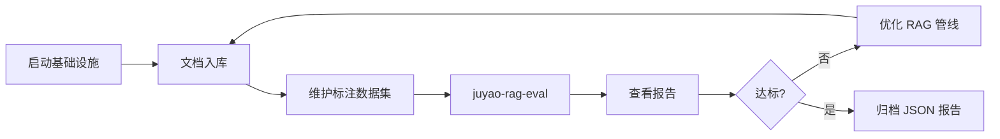

# RAGAS 测评流程

## 总览



## 1. 启动基础设施

```powershell
docker compose up -d
ollama pull mxbai-embed-large:latest
```

## 2. 文档入库

测评集 `manifest.yaml` 中登记的 `source_docs` 需先入库：

```powershell
juyao-ingest --file src/data/samples/sample_medical.txt
```

## 3. 维护标注数据集

在 `src/rag_eval/datasets/` 下按业务域分子目录，每行一条 JSONL：

```json
{
  "question": "感冒通常由什么引起？",
  "ground_truth": "感冒通常由病毒感染引起。"
}
```

新增数据集后更新 `datasets/manifest.yaml` 登记说明与对应入库文档。

## 4. 执行测评

```powershell
juyao-rag-eval --dataset default/sample_qa.jsonl --output reports/run_001.json
```

可选指标（默认全开）：

```powershell
juyao-rag-eval --metrics faithfulness,answer_relevancy
```

## 5. 解读结果

终端输出汇总均值与逐条明细；`--output` 生成 JSON，便于版本对比。

## 6. 迭代

- 调整检索、切分、Prompt 后重新入库 / 重跑测评
- 对比多次 `--output` JSON 的 `summary` 字段

## 当前测评范围

- **已覆盖**：`search_context` 检索 + 简单生成（与 CLI 问答链路一致）
- **后续优化**：完整 Agentic 流（`routed_flow`）、Markdown/HTML 报告、CI 集成
